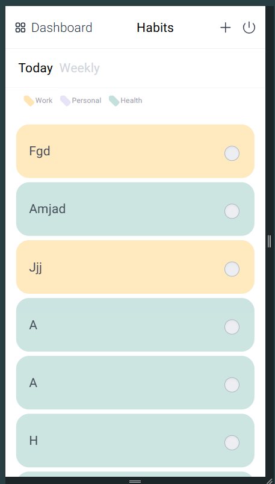

# Project Name

## Overview
This is a React.js application designed for **Habit Tracking **. The application allows users to create, update, and manage habit within different category and frequency . It features user authentication, Habit Management ,  Streaks & Rewards and Progress . 
## Table of Contents
- [Features](#features)
- [Installation](#installation)
- [Sample Pages](#sample-pages)
- [Technologies Used](#technologies-used)


## Features
- **User Authentication**: Register and Login functionality and saving accessToken in LocalStorage for persisting user. 
- **Habit Management**: Add, update, and delete tasks
- **Streaks & Rewards**: Increment and adjusting Rewards , points , badges  and streaks
- **Responsive Design**: Works across desktop and mobile devices
- **progress charts**: Showing Heat map , weekily view , charts by category usage , pie charts etc 


## Installation
Follow these steps to set up the project locally.

### Prerequisites
- **Node.js** (version 18+)
- **npm** or **yarn**

### Steps
1. Clone the repository:
    ```bash
    git clone https://github.com/Akhancode/habitReminder-assessment.git
    ```
2. Navigate to the project directory:
    ```bash
    cd habitReminder-assessment
    ```
3. Install dependencies:
    ```bash
    npm install
    ```
   or, if using yarn:
    ```bash
    yarn install
    ```
4. Start the development server:
    ```bash
    npm run dev
    ```
   or, if using yarn:
    ```bash
    yarn run dev
    ```

5. Open your browser and go to [http://localhost:5173](http://localhost:5173) to view the app.

## Sample Pages

### 1. **Login Page**
   - **Desktop View**  
     
   - **Mobile View**  
     
   > Simple, user-friendly login screen with unique email authentication.
### 2. **Register Page**
   - **Desktop View**  
     
   - **Mobile View**  
     

   > Clean and straightforward registration screen with email and password input fields, designed to be user-friendly on both desktop and   
     mobile devices.


### 3. **Today Home Page **
   - **Desktop View**  
     
   - **Mobile View**  
     
   > A dashboard that displays all tasks in different columns. Each column represents a task status.

### 3. **Weekly Home Page **
   - **Desktop View**  
     
   - **Mobile View**  
     
   > A dashboard that displays all tasks in different columns. Each column represents a task status.

### 3. **Create Page**
   - **Desktop View**  
     
   - **Mobile View**  
     

### 3. **Update Page**
   - **Desktop View**  
     
   - **Mobile View**  
     

### 4. **Dashboard Page**
   - **Desktop View**  
     
   - **Mobile View**  
     

### 4. **Progress Page**
   - **Desktop View**  
     
   - **Mobile View**  
     

## Technologies Used
- **React.js**: JavaScript library for building user interfaces
- **React Router**: For managing navigation between pages
- **Tailwind CSS**: For utility-first, responsive, and customizable styling
- **Chart.js**: For interactive and responsive charts and data visualizations
- **Axios**: For handling HTTP requests to interact with APIs


Thank you for checking out the project!
